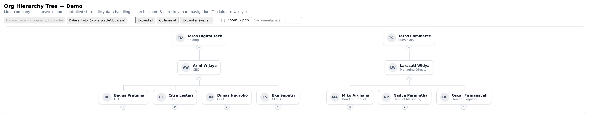
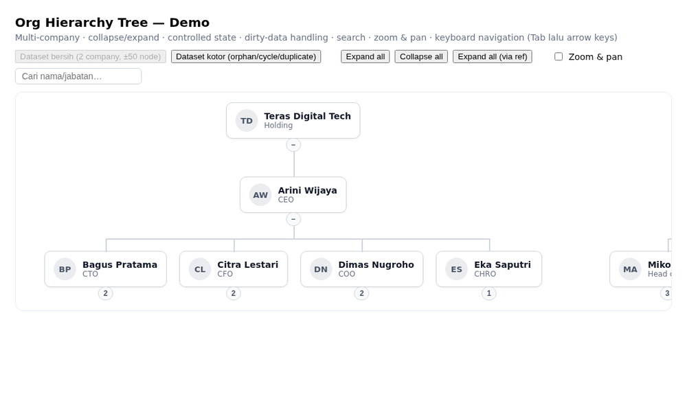
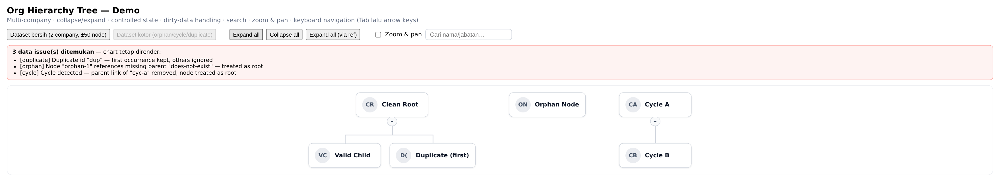

# org-hierarchy-tree

Komponen React reusable untuk merender hierarchy organisasi dari **data flat** — org chart, reporting line, struktur multi-company. Zero runtime dependency (React sebagai peer), fully typed, ~5 kB gzip.

**[🔗 Live demo](https://nichophilipo19.github.io/organization-hierarchy/)** — expand/collapse, search, zoom & pan langsung di browser.



*Interaksi: expand/collapse, expand all, search + highlight, zoom & pan:*



```tsx
import { OrgChart } from 'org-hierarchy-tree';
import 'org-hierarchy-tree/style.css'; // wajib — CSS tidak ter-inject otomatis

<OrgChart
  data={[
    { id: 'ceo', parentId: null, name: 'Aminah', title: 'CEO' },
    { id: 'cto', parentId: 'ceo', name: 'Budi', title: 'CTO' },
    { id: 'eng', parentId: 'cto', name: 'Citra', title: 'Engineer' },
  ]}
/>;
```

## Fitur

Collapse/expand per node dengan badge jumlah bawahan · multiple roots (multi-company) · controlled & uncontrolled expand state · `renderNode` override penuh · validasi data kotor (orphan/cycle/duplicate) dengan laporan terstruktur · keyboard navigation sesuai pola WAI-ARIA tree · zoom & pan opsional · search highlight · `expandAll/collapseAll` via ref.

## Menjalankan demo

```bash
npm install
npm run dev        # demo Vite: 2 company ±50 node, dataset kotor, search, zoom
npm test           # 32 unit + component test
npm run bench      # benchmark buildTree & render
npm run build:lib  # → dist-lib/ (index.js + index.d.ts + style.css)
npm run visuals    # regenerate screenshot/GIF README (butuh npx playwright install chromium)
```

## Format data

Flat array — bentuk natural dari API/database, tanpa transformasi:

```ts
interface OrgNode {
  id: string;
  parentId: string | null; // null = root; beberapa root = multi-company
  name: string;
  title?: string;
  avatarUrl?: string;
  data?: Record<string, unknown>; // payload bebas, diteruskan ke renderNode
}
```

Punya data nested? `fromNested(nested)` mengonversinya sekali jalan.

> `data` sebaiknya referentially stable antar render (state/memo, bukan array inline). Saat identitas `data` berubah, tree di-rebuild dan — pada mode uncontrolled — `defaultExpandedDepth` diterapkan ulang.

## Props

| Prop | Tipe | Keterangan |
|---|---|---|
| `data` | `OrgNode[]` | Wajib. Flat array. |
| `renderNode` | `(node, state) => ReactNode` | Override kartu. `state = { isExpanded, hasChildren, childCount, depth, isHighlighted }` |
| `defaultExpandedDepth` | `number` | Uncontrolled. Default `1` (root + level 1 terbuka). |
| `expandedIds` | `ReadonlySet<string>` | Controlled. Berisi id node yang **terbuka**. |
| `onExpandedChange` | `(ids: Set<string>) => void` | Dipanggil saat user toggle. |
| `onNodeClick` | `(node) => void` | Klik kartu — terpisah dari toggle expand. |
| `onDataError` | `(errors: TreeError[]) => void` | Orphan/cycle/duplicate — dipanggil sekali per perubahan data, aman ditulis inline. |
| `highlightedIds` | `ReadonlySet<string>` | Node hasil search — kartu diberi ring, `state.isHighlighted` untuk renderNode custom. |
| `zoomable` | `boolean` | Zoom (scroll/tombol) & pan (drag). Default `false`. |
| `emptyState` | `ReactNode` | Ditampilkan saat `data` kosong. |
| `className` | `string` | Class tambahan pada container. |
| `ref` | `Ref<OrgChartHandle>` | `{ expandAll(), collapseAll() }` |

### Controlled vs uncontrolled

Mengikuti konvensi `value`/`defaultValue`: beri `expandedIds` → controlled (state milik Anda); tanpa itu → internal, diinisialisasi dari `defaultExpandedDepth`.

```tsx
const [expanded, setExpanded] = useState(new Set(['ceo']));
<OrgChart data={data} expandedIds={expanded} onExpandedChange={setExpanded} />;
```

### Search + auto-expand path

```tsx
import { ancestorsOf } from 'org-hierarchy-tree';

const hits = data.filter((n) => n.name.includes(q)).map((n) => n.id);
setExpanded((prev) => {
  const next = new Set(prev);
  hits.forEach((id) => ancestorsOf(data, id).forEach((a) => next.add(a)));
  return next;
});
<OrgChart data={data} highlightedIds={new Set(hits)} ... />;
```

### Keyboard

Tab masuk ke chart (roving tabindex — satu tab stop), lalu: `↑`/`↓` antar node terlihat, `→` expand / ke anak pertama, `←` collapse / ke parent, `Home`/`End` awal/akhir, `Enter`/`Space` aktivasi (`onNodeClick`, atau toggle bila tidak ada).

### Theming

Kartu default & connector membaca CSS custom properties — set di container mana pun:

```css
.my-chart {
  --orgchart-card-bg: #0b1220;
  --orgchart-line-color: #334155;
  --orgchart-highlight-color: #f79009;
  --orgchart-focus-color: #2e90fa;
}
```

Kustomisasi struktural: pakai `renderNode`.

### Data kotor

Chart tetap render sebisanya; setiap masalah dilaporkan via `onDataError`: orphan → jadi root, cycle → satu parent-link diputus (node jadi root), duplicate id → yang pertama menang.



## Performa (terukur, bukan klaim)

`npm run bench` — renderToString, Linux container (angka mean):

| Skenario | Hasil | Target NFR-1 |
|---|---|---|
| buildTree 100 / 1.000 / 10.000 node | 0,013 / 0,15 / 2,5 ms | O(n) |
| Render 100 node ~20% expanded | 0,52 ms | < 100 ms |
| Re-render pasca 1 toggle (100 node) | 0,53 ms | < 16 ms |
| Render 1.000 node depth-3 expanded | 2,0 ms | — |

Subtree collapsed tidak di-render ke DOM, jadi biaya mengikuti jumlah node *terlihat*, bukan total.

## Roadmap

Radial view (SVG renderer, shared hooks) dan publish ke npm menyusul — lihat TECHNICAL_DESIGN.md §8.

## Dokumentasi

- **[PRD.md](PRD.md)** — requirement & user stories (FR-x/NFR-x), termasuk scope yang sengaja ditahan (radial view, npm publish).
- **[TECHNICAL_DESIGN.md](TECHNICAL_DESIGN.md)** — keputusan desain dan alasannya: kenapa flat array, kenapa CSS connector bukan SVG, kenapa logic dipisah dari view.
- **[ANALYSIS.md](ANALYSIS.md)** — audit jujur yang melacak PRD → design → kode → test per ID, termasuk bug yang ditemukan & cara fix-nya, bukan cuma daftar fitur.
- **[CHANGELOG.md](CHANGELOG.md)** — riwayat perubahan per rilis.
